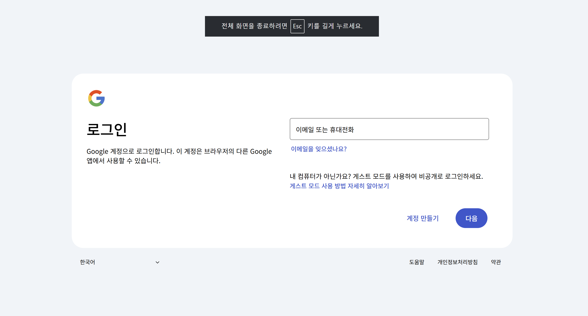
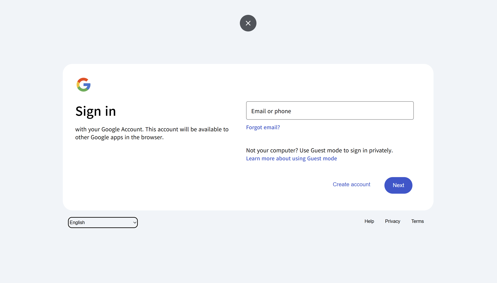
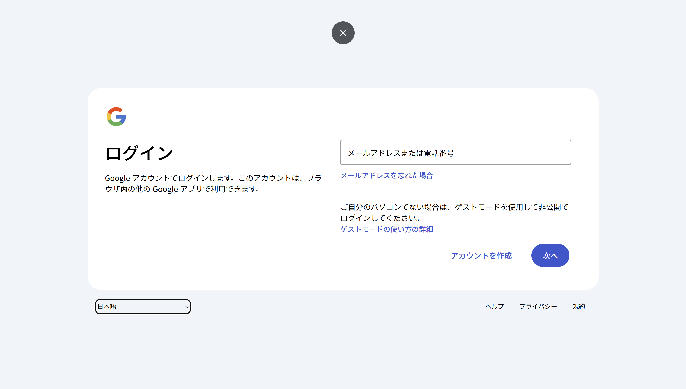
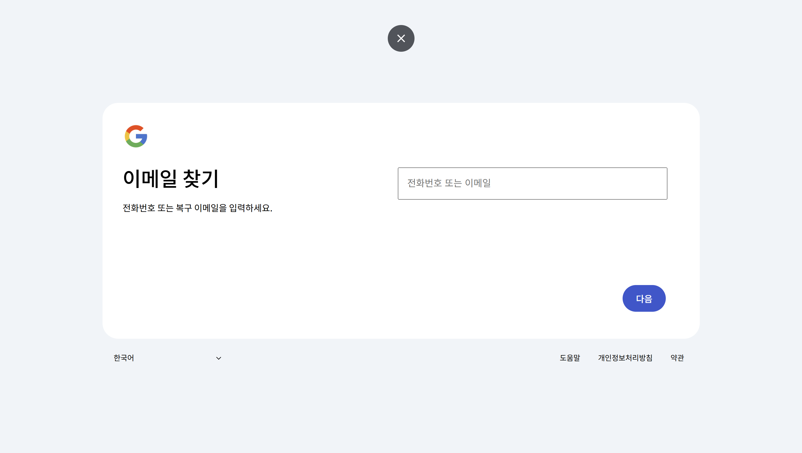

# Google Login 화면 Clone Coding

이 프로젝트는 Google 로그인 페이지를 HTML, CSS, JS를 활용하여 클론한 것입니다.  
실제 구글 로그인 UI를 참고하여 최대한 유사하게 구현하는 데 중점을 두었습니다.

## ✅ 구현한 기능

- Google 로그인 화면 UI 구현
- "이메일 찾기" 클릭 시 다음 화면으로 전환
- 언어 변경 시 JS를 통해 동적으로 텍스트 변경

## 🔧 개선 예정

- 이메일 입력 후 "다음" 클릭 시 비밀번호 입력 화면으로 이동 (JS로 연결)
- 더 나은 반응형 디자인 구현

  
  
  
  

